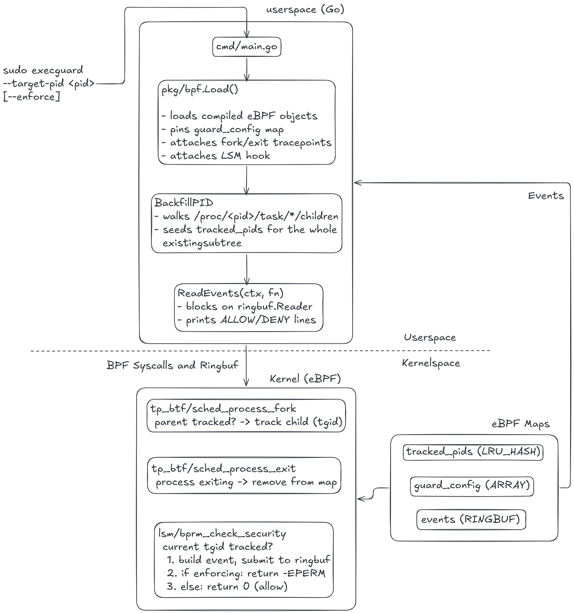

# execguard — Design Documentation

## 1. Overview

execguard is an eBPF-based process guard for Linux. Given a target PID, it
tracks that process and every descendant it forks, observes every `execve`
attempt made by that process tree at the kernel's own enforcement point, and
optionally denies those exec attempts outright.

The system has two halves:

- **Kernel side** (`bpf/src/guard.bpf.c`): a small eBPF program, loaded via
  the LSM (Linux Security Module) hook framework and two scheduler
  tracepoints, that maintains the tracked-PID set and makes the allow/deny
  decision in-kernel.
- **Userspace side** (`cmd/`, `pkg/bpf/`): a Go binary that loads and attaches
  the eBPF program, seeds the tracked-PID map from an existing process tree,
  streams exec events out of a ring buffer, and can flip the running
  instance between monitor and enforce mode.

## 2. Architecture



### 2.1 Kernel side (`bpf/src/guard.bpf.c`)

Three BPF programs, sharing three maps:

| Program | Attach point | Purpose |
|---|---|---|
| `execguard_fork` | `tp_btf/sched_process_fork` | Propagate tracked-tree membership from parent to child |
| `execguard_exit` | `tp_btf/sched_process_exit` | Remove exited processes from the tracked set |
| `execguard_sec` | `lsm/bprm_check_security` | The actual enforcement/observation point for `execve` |

| Map | Type | Key → Value | Purpose |
|---|---|---|---|
| `tracked_pids` | `BPF_MAP_TYPE_LRU_HASH`, 8192 entries | `u32` tgid → `u8` (sentinel `1`) | The set of tgids currently considered part of the guarded tree |
| `guard_config` | `BPF_MAP_TYPE_ARRAY`, 1 entry | `u32` key `0` → `u8` enforce flag | Single global on/off switch for enforcement, read on every exec |
| `events` | `BPF_MAP_TYPE_RINGBUF`, 256 KiB | — | Stream of `struct event` records to userspace |

### 2.2 Userspace side (`cmd/`, `pkg/bpf/`)

| File | Responsibility |
|---|---|
| `cmd/main.go` | CLI entry point: flag parsing, dispatch between "attach a new instance" and "reconfigure a running instance," signal handling, event printing |
| `pkg/bpf/gen.go` | `go:generate` directive driving `bpf2go` to compile the C source and generate Go bindings (`guard_bpfel.go` / `guard_bpfeb.go` + embedded `.o` objects) |
| `pkg/bpf/loader.go` | `Guard` type: loading generated objects, pinning `guard_config`, attaching all three programs, teardown, and the `IsRunning`/`SetEnforcingRunning` helpers for talking to an already-running instance |
| `pkg/bpf/maps.go` | Map-mutation helpers: `TrackPID`, `SetEnforcing`, and the `/proc`-walking backfill logic |
| `pkg/bpf/events.go` | Ring buffer consumer: `Event` struct mirroring the C `struct event`, and `ReadEvents` which decodes records and invokes a callback |

### 2.3 Event structure

```c
struct event {
    __u32 pid;                  /* tracked process's tgid */
    __u32 ppid;                 /* its parent's tgid */
    __u8  command[16];          /* TASK_COMM_LEN, from bpf_get_current_comm */
    __u8  path[256];            /* MAX_PATH_LEN, from bprm->filename */
    __u8  denied;               /* 1 if this exec was denied, 0 if allowed */
};
```

## 3. Repository Map

```
bpf/
  include/vmlinux.h        
  src/guard.bpf.c          the eBPF program
cmd/
  main.go                  CLI entry point
pkg/bpf/
  gen.go                   go:generate directive for bpf2go
  guard_bpfel.go           generated: little-endian objects + Go bindings
  guard_bpfeb.go           generated: big-endian objects + Go bindings
  guard_bpfel.o / .eb.o    generated: compiled eBPF object files (embedded)
  loader.go                Guard lifecycle: load, attach, pin, close
  maps.go                  TrackPID / SetEnforcing / /proc backfill
  events.go                Event struct + ring buffer consumer
demo/
  demo.py                  Flask app with a /run-id endpoint (subprocess.run)
  requirements.txt
docs/
  design.md                this document
configs/clang-format       C formatting config, used by scripts/fmt.sh
scripts/fmt.sh             formats Go + C sources
Makefile                   build/generate/run/fmt/clean targets
```
